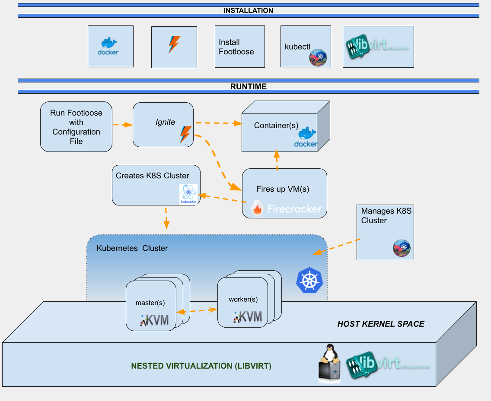

# Footloose --> Ignite --> k8s cluster --> kube-bench

[kube-bench](https://github.com/aquasecurity/kube-bench) is a Go application created by the folks at [Aqua Security](https://www.aquasec.com) that checks whether Kubernetes is deployed securely 
by running the checks documented in the [CIS Kubernetes Benchmark](https://www.cisecurity.org/benchmark/kubernetes/).

Since this tool runs on a Kubernetes cluster, we need it a quick way to fire up a
cluster, so we decided to look into Ignite.

 [Weave Ignite](https://github.com/weaveworks/ignite) is an open source Virtual Machine (VM) manager with a container UX that is fast 
 and secure. It utilizes Firecracker under the hood to instantiate the VMs.
 
Since a kubernetes cluster and [kube-bench](https://github.com/aquasecurity/kube-bench) requires different kinds of clusters running
to exercise the various CIS benchmarks tests for a particular version.
The fact that possibly a cluster with more than one VM would needs to be running and those
VMs be connected with each other, lead us to understand we needed a solutions that could
create fast VMs and form them in a cluster manner - Enter [Weave Footloose](https://github.com/weaveworks/footloose).

[Weave Footloose](https://github.com/weaveworks/footloose) creates containers that look like virtual machines. Starting with version 0.5.X, 
Footloose integrates with Ignite version 0.4.2+
This integration enables Footloose to fire up Ignite VMs and combined with some Docker+Kubeadm 
magic, a Kubernetes cluster can be formed. Once the cluster is up and running, we can deploy 
[kube-bench](https://github.com/aquasecurity/kube-bench) or any other application.

Let's walk through this example.

Firecracker requires to be running on [KVM](https://www.linux-kvm.org/page/Main_Page) environment, like Linux on Bare-metal, with that 
in mind, we can create a VM with nested Virtualization using [Vagrant](https://www.vagrantup.com/), [Libvirt](https://libvirt.org/index.html), and [vagrant-libvirt](https://github.com/vagrant-libvirt/vagrant-libvirt) plugin.

The following diagram depicts the scenario I'll be covering:



Here is a snippet of a Vagrantfile:

```v
Vagrant.configure("2") do |config|
...
config.vm.box = "generic/ubuntu1804"
...
config.vm.provider :libvirt do |domain|
    domain.memory = 4048
    domain.cpus = 6
end
...
``` 

# Start the Host VM
Once the VM is up and running, `sudo -i` , create directory `work`, and we can start setting it up.

```console
$ vagrant up
$ vagrant ssh
$ sudo -i
# mkdir work && cd work
```


# Dependencies

We'll start by installing some dependencies:

```console
# apt-get update && apt-get install -y --no-install-recommends dmsetup openssh-client git binutils
```

# Install [Docker](https://docs.docker.com/install/linux/docker-ce/ubuntu/) 

# Install Go https://golang.org/dl/
```console
# wget -c https://dl.google.com/go/go1.12.7.linux-amd64.tar.gz -O - | tar -C /usr/local  -xz
export PATH=/usr/local/go/bin:$PATH
```

# Install Ignite and Footloose
 
## Install ignite
```console
export VERSION=v0.4.2
curl -fLo ignite https://github.com/weaveworks/ignite/releases/download/${VERSION}/ignite
chmod +x ignite
sudo mv ignite /usr/local/bin
```

## Install footloose
Note: 
 At the time of this recording the latest footloose release does not support Ignite
 The master branch of the github repository does contain the required code, so
 we'll install it from source.
 This requires Go v1.12+ to be installed on your system
 
```console
git clone https://github.com/weaveworks/footloose.git
cd footloose
go build
mv footloose /usr/local/bin
cd ..
```

# Install kubectl
```console
# wget https://storage.googleapis.com/kubernetes-release/release/v1.15.1/bin/linux/amd64/kubectl
# chmod +x kubectl
# mv kubectl /usr/local/bin
```

# Prepare cluster files

```console
# wget https://raw.githubusercontent.com/robertojrojas/kube-bench-footloose-ignite/master/prepare.sh
# chmod +x prepare.sh
# ./prepare.sh
```

# Build kluster Docker image
### This image is a workaround to provide the ability to inject custom scripts into the VMs

```console
# mkdir kluster
# cd kluster
wget https://raw.githubusercontent.com/robertojrojas/kube-bench-footloose-ignite/master/kluster/Dockerfile
wget https://raw.githubusercontent.com/robertojrojas/kube-bench-footloose-ignite/master/kluster/build-docker.sh
wget https://raw.githubusercontent.com/robertojrojas/kube-bench-footloose-ignite/master/kluster/kluster.service
wget https://raw.githubusercontent.com/robertojrojas/kube-bench-footloose-ignite/master/kluster/kluster.sh
chmod +x build-docker.sh
./build-docker.sh
cd ..
```

# Get the footloose config file

```console
# wget https://raw.githubusercontent.com/robertojrojas/kube-bench-footloose-ignite/master/footloose.yaml.k8s

# sed "s,<ABSOLUTE_PATH>,$(pwd),g" footloose.yaml.k8s > footloose.yaml.k8s.mod
```

# Get Kubernetes scripts

```console
# wget https://raw.githubusercontent.com/robertojrojas/kube-bench-footloose-ignite/master/haproxy.cfg

# wget https://raw.githubusercontent.com/robertojrojas/kube-bench-footloose-ignite/master/k8s-master.sh

# wget https://raw.githubusercontent.com/robertojrojas/kube-bench-footloose-ignite/master/k8s-worker.sh

```


## Instantiate the cluster vms

```console
# footloose --config footloose.yaml.k8s.mod create
```

# This is needed to route requests to k8s
```console
# docker run -d -v $(pwd)/haproxy.cfg:/usr/local/etc/haproxy/haproxy.cfg -p 6443:443 haproxy:alpine
```

# Setup Kubectl to have access to the cluster running on those vms

```console
# export KUBECONFIG=$(pwd)/run/admin.conf
```

# Wait for the kubernetes worker ( the 2nd vm) to come up and join the cluster

```console
# kubectl get nodes | grep ' Ready    <none>' > /dev/null
# until [ $? -eq 0 ]; do
   echo 'waiting for worker to be ready...'
   sleep 5s
   kubectl get nodes | grep ' Ready    <none>' > /dev/null
done
```

You would see the following output for about 3-5 minutes

```console
waiting for worker to be ready...
Unable to connect to the server: EOF
waiting for worker to be ready...
Unable to connect to the server: EOF
waiting for worker to be ready...
waiting for worker to be ready...
Unable to connect to the server: EOF
waiting for worker to be ready...
Unable to connect to the server: EOF
waiting for worker to be ready...
waiting for worker to be ready...
waiting for worker to be ready...
waiting for worker to be ready...
waiting for worker to be ready...
....
waiting for worker to be ready...
waiting for worker to be ready...
waiting for worker to be ready...
....
```

# After 3-5 minutes, the worker should have joined the k8s cluster, Let's get deploy the kube-bench
# and wait for the CIS benchmark to execute to completion.

```console
# wget  https://raw.githubusercontent.com/robertojrojas/kube-bench-footloose-ignite/master/job-worker.yaml

# kubectl apply -f job-worker.yaml

# echo "wait for the kube-bench to execute..."
# sleep 10s
```

# Let's take a look at the kube-bench output
```console
$ kubectl logs $(kubectl get pod --no-headers | grep kube | awk '{print $1}')
```

The results from running the kube-bench would be similar to the following:


```v
[INFO] 2 Worker Node Security Configuration
[INFO] 2.1 Kubelet
[PASS] 2.1.1 Ensure that the --anonymous-auth argument is set to false (Scored)
[PASS] 2.1.2 Ensure that the --authorization-mode argument is not set to AlwaysAllow (Scored)
[PASS] 2.1.3 Ensure that the --client-ca-file argument is set as appropriate (Scored)
[PASS] 2.1.4 Ensure that the --read-only-port argument is set to 0 (Scored)
[PASS] 2.1.5 Ensure that the --streaming-connection-idle-timeout argument is not set to 0 (Scored)
[FAIL] 2.1.6 Ensure that the --protect-kernel-defaults argument is set to true (Scored)
[PASS] 2.1.7 Ensure that the --make-iptables-util-chains argument is set to true (Scored)
[PASS] 2.1.8 Ensure that the --hostname-override argument is not set (Scored)
[FAIL] 2.1.9 Ensure that the --event-qps argument is set to 0 (Scored)
[FAIL] 2.1.10 Ensure that the --tls-cert-file and --tls-private-key-file arguments are set as appropriate (Scored)
[PASS] 2.1.11 Ensure that the --cadvisor-port argument is set to 0 (Scored)
[PASS] 2.1.12 Ensure that the --rotate-certificates argument is not set to false (Scored)
[PASS] 2.1.13 Ensure that the RotateKubeletServerCertificate argument is set to true (Scored)
[WARN] 2.1.14 Ensure that the Kubelet only makes use of Strong Cryptographic Ciphers (Not Scored)
[INFO] 2.2 Configuration Files
[FAIL] 2.2.1 Ensure that the kubelet.conf file permissions are set to 644 or more restrictive (Scored)
[FAIL] 2.2.2 Ensure that the kubelet.conf file ownership is set to root:root (Scored)
[FAIL] 2.2.3 Ensure that the kubelet service file permissions are set to 644 or more restrictive (Scored)
[FAIL] 2.2.4 Ensure that the kubelet service file ownership is set to root:root (Scored)
[FAIL] 2.2.5 Ensure that the proxy kubeconfig file permissions are set to 644 or more restrictive (Scored)
[FAIL] 2.2.6 Ensure that the proxy kubeconfig file ownership is set to root:root (Scored)
[WARN] 2.2.7 Ensure that the certificate authorities file permissions are set to 644 or more restrictive (Scored)
[PASS] 2.2.8 Ensure that the client certificate authorities file ownership is set to root:root (Scored)
[PASS] 2.2.9 Ensure that the kubelet configuration file ownership is set to root:root (Scored)
[PASS] 2.2.10 Ensure that the kubelet configuration file has permissions set to 644 or more restrictive (Scored)

== Remediations ==
2.1.6 If using a Kubelet config file, edit the file to set protectKernelDefaults: true .
If using command line arguments, edit the kubelet service file
/etc/systemd/system/kubelet.service on each worker node and
set the below parameter in KUBELET_SYSTEM_PODS_ARGS variable.
--protect-kernel-defaults=true
Based on your system, restart the kubelet service. For example:
systemctl daemon-reload
systemctl restart kubelet.service

2.1.9 If using a Kubelet config file, edit the file to set eventRecordQPS: 0 .
If using command line arguments, edit the kubelet service file
/etc/systemd/system/kubelet.service on each worker node and
set the below parameter in KUBELET_SYSTEM_PODS_ARGS variable.
--event-qps=0
Based on your system, restart the kubelet service. For example:
systemctl daemon-reload
systemctl restart kubelet.service

2.1.10 If using a Kubelet config file, edit the file to set tlsCertFile to the location of the certificate
file to use to identify this Kubelet, and tlsPrivateKeyFile to the location of the
corresponding private key file.
If using command line arguments, edit the kubelet service file
/etc/systemd/system/kubelet.service on each worker node and
set the below parameters in KUBELET_CERTIFICATE_ARGS variable.
--tls-cert-file=<path/to/tls-certificate-file>
file=<path/to/tls-key-file>
Based on your system, restart the kubelet service. For example:
systemctl daemon-reload
systemctl restart kubelet.service

2.1.14 If using a Kubelet config file, edit the file to set TLSCipherSuites: to TLS_ECDHE_ECDSA_WITH_AES_128_GCM_SHA256,TLS_ECDHE_RSA_WITH_AES_128_GCM_SHA256,TLS_ECDHE_ECDSA_WITH_CHACHA20_POLY1305,TLS_ECDHE_RSA_WITH_AES_256_GCM_SHA384,TLS_ECDHE_RSA_WITH_CHACHA20_POLY1305,TLS_ECDHE_ECDSA_WITH_AES_256_GCM_SHA384,TLS_RSA_WITH_AES_256_GCM_SHA384,TLS_RSA_WITH_AES_128_GCM_SHA256
If using executable arguments, edit the kubelet service file /var/lib/kubelet/config.yaml on each worker node and set the below parameter.
--tls-cipher-suites=TLS_ECDHE_ECDSA_WITH_AES_128_GCM_SHA256,TLS_ECDHE_RSA_WITH_AES_128_GCM_SHA256,TLS_ECDHE_ECDSA_WITH_CHACHA20_POLY1305,TLS_ECDHE_RSA_WITH_AES_256_GCM_SHA384,TLS_ECDHE_RSA_WITH_CHACHA20_POLY1305,TLS_ECDHE_ECDSA_WITH_AES_256_GCM_SHA384,TLS_RSA_WITH_AES_256_GCM_SHA384,TLS_RSA_WITH_AES_128_GCM_SHA256

2.2.1 Run the below command (based on the file location on your system) on the each worker
node. For example,
chmod 644 /var/lib/kubelet/kubeconfig

2.2.2 Run the below command (based on the file location on your system) on the each worker
node. For example,
chown root:root /var/lib/kubelet/kubeconfig

2.2.3 Run the below command (based on the file location on your system) on the each worker
node. For example,
chmod 755 /etc/systemd/system/kubelet.service

2.2.4 Run the below command (based on the file location on your system) on the each worker
node. For example,
chown root:root /etc/systemd/system/kubelet.service

2.2.5 Run the below command (based on the file location on your system) on the each worker
node. For example,
chmod 644 /var/lib/kubelet/kubeconfig

2.2.6 Run the below command (based on the file location on your system) on the each worker
node. For example,
chown root:root /var/lib/kubelet/kubeconfig

2.2.7 Run the following command to modify the file permissions of the --client-ca-file
chmod 644 <filename>


== Summary ==
13 checks PASS
9 checks FAIL
2 checks WARN
0 checks INFO
```


# Here is screen recording of the above steps:

[](https://asciinema.org/a/C1GzS5ndlbOMUf1G9UftZjd7g)